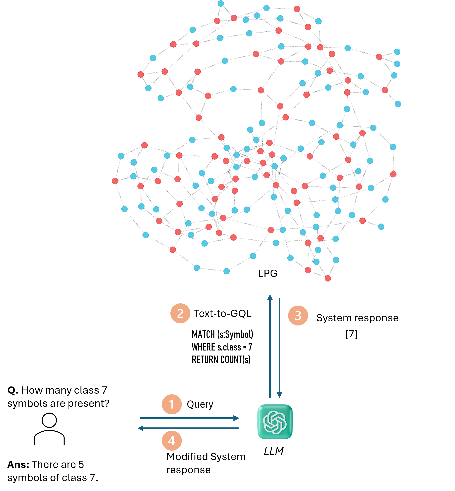

# PID-KnowledgeGraph-demo

# Question-Answering on Engineering Drawings (using RAG concepts)

This repository provides a minimal demo of **Retrieval-Augmented Generation (RAG)** on Engineering Drawings, specifically in the context of **Piping & Instrumentation Diagrams**. The included image illustrates how the whole system works.  

## Process Overview  
The included **RAG process image** visually represents how retrieval and generation interact to produce informed responses. 
<!--   -->

Step1: User asks a question
Step2: LLM converts the user question into a SQL/Cypher syntax
Step3: The generated Cypher syntax is executed on the Graph DB. Response is returned to LLM
Step4: LLM transforms the response in more human-readable format

### Applications in Civil Engineering & Process Industry
- **Automated code compliance checks**  
- **Project documentation assistance**  
- **AI-powered engineering knowledge retrieval**  
- **Information Accessibility**
- **Automating HAZOP studies**
- **Automated Material Take-offs**

This repository demonstrates how AI can bridge the gap between **data-driven retrieval** and **context-aware response generation** to enhance decision-making in engineering.  
